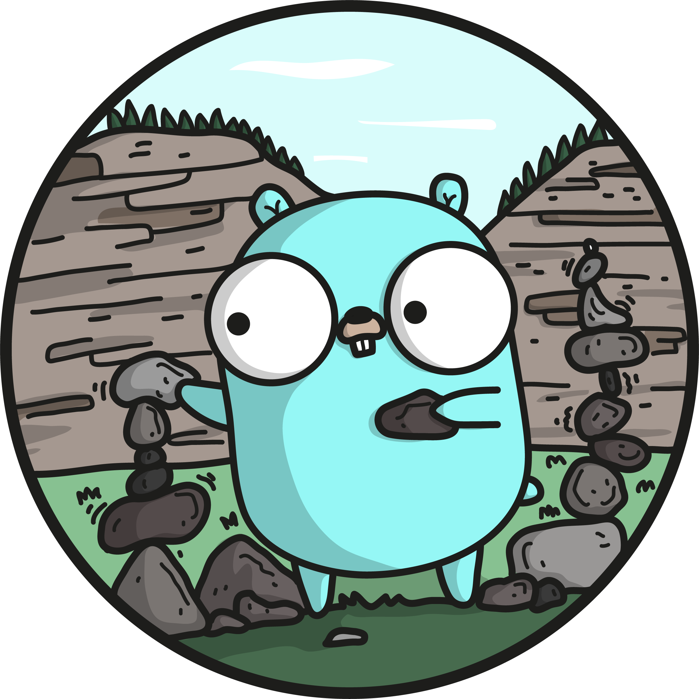
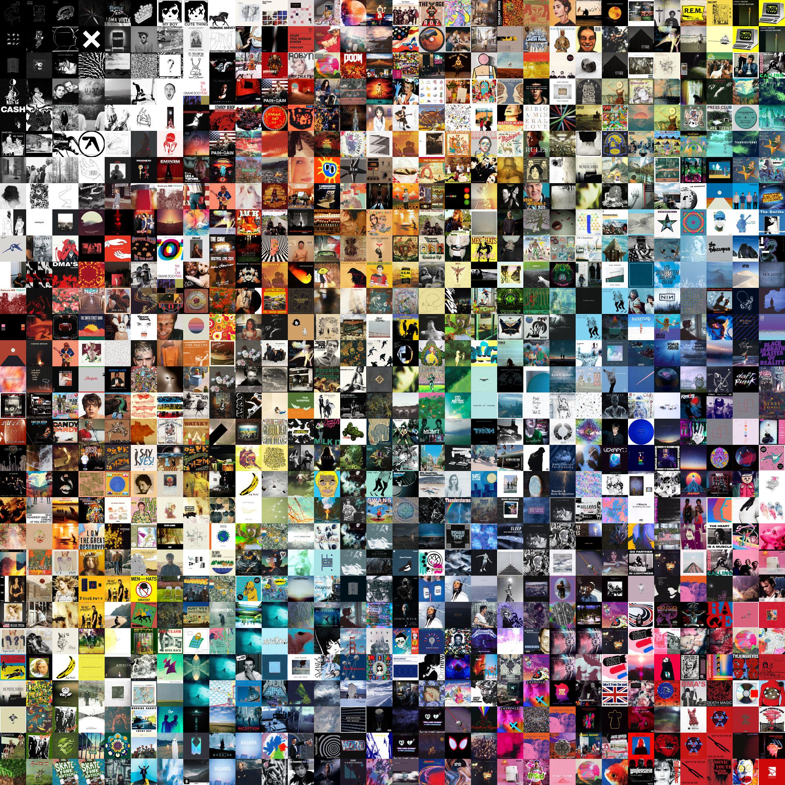

# go-rainbow-collage - Create Colour Sorted Collages



`go-rainbow-collage` lets you create colour sorted collages from an array of images.

## Installation

`go get -u github.com/conorbros/go-rainbow-collage`

## Usage

Import the library and supply an array of images and desired x/y dimensions of the collage.

```Go
import collage "github.com/conorbros/go-rainbow-collage"

// arguments require an array of images
images := make([]image.Image, 100)

collage, _ := collage.New(images, 10, 10)

// do something with the output
outputImage, _ := os.Create("output.jpeg")

jpeg.Encode(outputImage, collage, &jpeg.Options{Quality: 80})

```

## Examples


